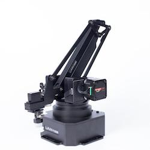

# uArm Python Wrapper



- [Overview](#overview)
- [Examples](#examples)
- [API Reference](#api-reference)
- [Calibration](#calibration)
- [Quirks](#quirks)
- [Features Wishlist](#features-wishlist)
- [Installation](#installation)
- [Firmware Update](#firmware-update)

## Overview

This project is a fork and thin wrapper around the [uArm-Python-SDK](https://github.com/uArm-Developer/uArm-Python-SDK) from uFactory. The goal of this fork is to create a more intuitive and easier to use set of controls for the [uArm Swift/SwiftPro](https://store.ufactory.cc/products/uarm), built on-top of the original Python API from uFactory.

Because this wrapper inherits from the original Python SDK from uFactory, all of their methods and functionalities are still available through this interface.

#### Basic Controls

```python
robot = uarm_scan_and_connect()
robot.home()
robot.move_to(x=150, y=20, z=10)
robot.pump(True)
robot.move_relative(y=-40, z=60)
robot.pump(False)
robot.sleep()
```

#### Recorded Movements

The wrapper also adds the ability to record and playback movements, through user-controlled motions while the motors are off. This makes orchestrating more complex motions much easier.

To record movements, run the recording script:

```bash
python -m uarm.record <RECORDING-NAME>
```

And then playback those recordings in your script:

```python
robot = uarm_scan_and_connect()
robot.home()
robot.playback('move-to-pen-holder')
robot.grip(True)
robot.playback('pick-up-pen')
robot.move_to(x=150, y=0, z=0)
robot.playback('draw-happy-face', relative=True)
robot.playback('move-to-pen-holder')
robot.grip(False)
robot.playback('release-pen')
robot.sleep()
```

#### Camera Tracking

It also includes an interface for using the OpenMV camera to detect object's positions, and translate them into the uArm's coordinate system for easier manipulation:

```python
robot = uarm_scan_and_connect()
camera = openmv.OpenMV(robot)
camera.move_to(x=150, y=0, z=120)       # move high up
image_pos = camera.read_json()          # read from the camera
object_pos = camera.position_from_image(**image_pos)
robot.move_to(**object_pos).pump(True)  # pick it up
robot.move_relative(z=20)
robot.pump(False)                       # drop it
```

## Examples

Some simple examples are included to show how the API wrapper can easily be used for simple movements and controls of the uArm Swift Pro:

#### Basics
- [Connecting to a uArm](examples/api-wrapper/connect.py)
- [Simulate for Unplugged Testing](examples/api-wrapper/simulate.py)
- [Move the Arm](examples/api-wrapper/move_arm.py)
- [Speed and Acceleration](examples/api-wrapper/speed_acceleration.py)
- [Rotate the Wrist](examples/api-wrapper/rotate_wrist.py)
- [Pick Up Items](examples/api-wrapper/pick_up.py)

#### More Things
- [Push/Pop the Speed Settings](examples/api-wrapper/speed_acceleration.py)
- [Disable the Motors](examples/api-wrapper/disable_motors.py)
- [Read the Position](examples/api-wrapper/position.py)
- [Chaining Commands](examples/api-wrapper/command_chaining.py)

#### Slightly More Advanced
- [Recording and Playback Movements](examples/api-wrapper/record.py)
- [Recording CLI Tool](uarm/record/README.md)
- [OpenMV Camera](examples/api-wrapper/openmv_camera.py)
- [Remote Control Over a Network](uarm/remote/README.md)
- [Using Original SwiftAPI Commands](examples/api-wrapper/original_swift_api.py)

## API Reference

The [API reference documentation can be found here](doc/api/swift_api_wrapper.md), which include methods and attributes of the `SwiftAPIWrapper` class.

This repository also include PDF guides distrubuted by uFactory, which are located in [this folder](doc/manuals).

## Calibration

Some configuration of the uArm and an attached OpenMV camera can be calibrated to make it more accurate. [Read more about how to calibrate here](./CALIBRATION.md).

## Quirks

The uArm Swift Pro has a few unique attributes and behaviors, which need to be understood before using the device. [Here is a document](./QUIRKS.md) describing the quirks and issues I've found while developing on this device.

- [When Powering](./QUIRKS.md#when-powering)
- [When Connecting](./QUIRKS.md#when-connecting)
- [Overheating](./QUIRKS.md#overheating)
- [Positions and Encoders](./QUIRKS.md#positions-and-encoders)
- [Reachable Coordinates](./QUIRKS.md#reachable-coordinates)
- [Buttons and GPIO Nonfunctional](./QUIRKS.md#buttons-and-gpio-nonfunctional)
- [Arched Movements](./QUIRKS.md#arched-movements)
- [Occasional Pauses](./QUIRKS.md#occasional-pauses)
- [Camera Mounting](./QUIRKS.md#camera-mounting)

It is recommended to read through this list before using the uArm Swift Pro and this Python wrapper.

## Features Wishlist

Keeping track of features to be added to this wrapper.

#### Features that Require Firmware Modifications

- Detect skipped steps and auto-adjust, using built-in rotary encoders

#### Control Over Network

Feature ideas for being able to run API methods over a network. The goal being that the uArm can be controlled from a web browser or tools like NodeJS, Max/MSP/Jitter, and P5.js

- Remote control over:
    - ~~OSC~~
    - Websocket
- Remote client libraries:
    - NodeJS (Websockets & OSC)
    - Browser (Websockets)
    - Max/MSP/Jitter (OSC)

## Installation

You can install through pip, or by cloning this repository and installing locally.

To install through pip, run:
```
pip install git+git://github.com/andySigler/uArm-Swift-Wrapper.git@master#egg=uArm-Swift-Wrapper
```

To install by cloning the repository, run:
```
git clone https://github.com/andySigler/uArm-Swift-Wrapper.git
cd uArm-Swift-Wrapper
python setup.py install
```

## Firmware Update

For consistancy, this Python wrapper requires the connected uArm Swift Pro to have firmware verion `4.5.0` flashed to the device. To help, this repository includes a script for updating a connected uArm Swift Pro to version `4.5.0`.

First, the script uses `avrdude` to flash the firmware to the uArm at the specified port. If you do not have `avrdude` already installed, you can install using Homebrew as follows:

```
brew install avrdude
```

Second, connect the uArm to your computer over USB and power the uArm on.

Finally, run the script:

```
bin/firmware/flash <PORT>`
```

The `<PORT>` argument is the name of the serial port the uArm occupies on your operating system. For example, on my Macbook, the command looks like:

```
bin/firmware/flash /dev/tty.usbmodem1417501
```

Or on Windows:

```
bin/firmware/flash COM2
```

## License
uArm-Python-SDK is published under the [BSD license](https://en.wikipedia.org/wiki/BSD_licenses)
